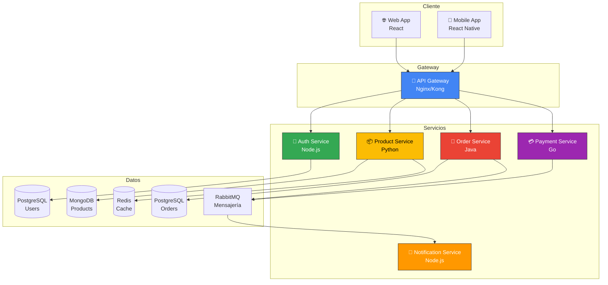
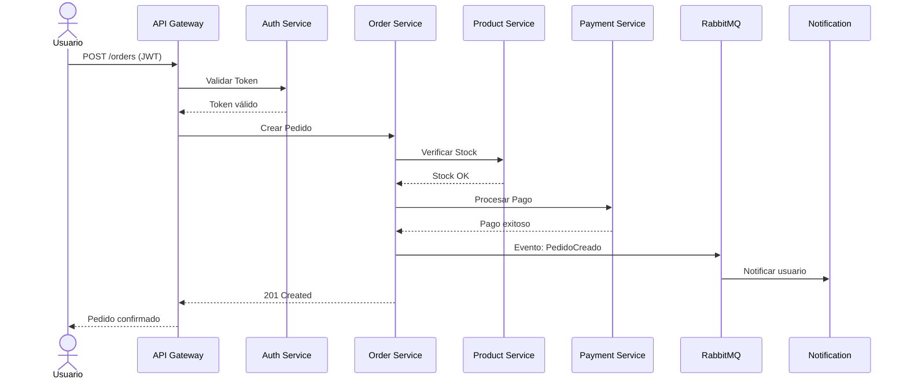

# Ejemplo: Arquitectura de Microservicios — E-Commerce

## Visión General



## Componentes

| Servicio | Tecnología | Base de Datos | Puerto | Responsabilidad |
|----------|-----------|:---:|:---:|------------------|
| API Gateway | Nginx/Kong | — | 80/443 | Routing, rate limiting, SSL |
| Auth Service | Node.js + Express | PostgreSQL | 3001 | Autenticación y autorización |
| Product Service | Python + FastAPI | MongoDB | 3002 | Catálogo de productos |
| Order Service | Java + Spring Boot | PostgreSQL | 3003 | Gestión de pedidos |
| Payment Service | Go + Gin | — | 3004 | Procesamiento de pagos |
| Notification Service | Node.js | — | 3005 | Emails, SMS, push |

## Flujo: Crear Pedido



## Decisiones Arquitectónicas

| ADR | Decisión | Razón |
|-----|----------|-------|
| ADR-001 | Database per Service | Independencia y escalabilidad |
| ADR-002 | Event-driven para notificaciones | Desacoplamiento |
| ADR-003 | API Gateway centralizado | Seguridad y routing unificado |
| ADR-004 | JWT para autenticación | Stateless, escalable |

## Estructura de Carpetas

```
ecommerce/
├── services/
│   ├── auth-service/
│   │   ├── src/
│   │   ├── tests/
│   │   ├── Dockerfile
│   │   └── package.json
│   ├── product-service/
│   │   ├── src/
│   │   ├── tests/
│   │   ├── Dockerfile
│   │   └── requirements.txt
│   └── ...
├── gateway/
│   └── nginx.conf
├── docker-compose.yml
├── docker-compose.prod.yml
└── README.md
```
