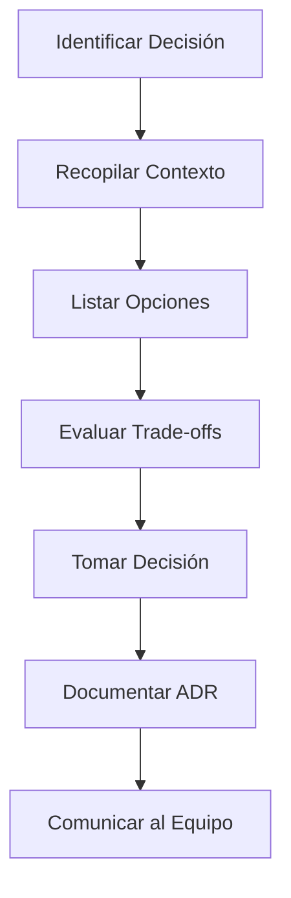

# Framework de Decisiones Arquitectónicas

## Proceso de Decisión

## Matriz de Evaluación de Trade-offs

Para cada opción arquitectónica, evalúa en escala 1-5:

| Criterio | Peso | Opción A | Opción B | Opción C |
|----------|:----:|:--------:|:--------:|:--------:|
| Complejidad de implementación | 20% | ? | ? | ? |
| Escalabilidad | 25% | ? | ? | ? |
| Mantenibilidad | 20% | ? | ? | ? |
| Performance | 15% | ? | ? | ? |
| Costo operacional | 10% | ? | ? | ? |
| Experiencia del equipo | 10% | ? | ? | ? |
| **Total ponderado** | 100% | ? | ? | ? |

## Preguntas Clave para Cada Decisión

### Sobre el Negocio
1. ¿Cuál es el time-to-market requerido?
2. ¿Cuántos usuarios se esperan (ahora y en 2 años)?
3. ¿Cuál es el presupuesto para infraestructura?
4. ¿Hay requisitos regulatorios (GDPR, HIPAA, PCI-DSS)?

### Sobre el Equipo
1. ¿Cuántos desarrolladores hay?
2. ¿Qué experiencia tienen con las tecnologías propuestas?
3. ¿Hay capacidad para operar la solución propuesta?

### Sobre la Tecnología
1. ¿Qué tan madura es la tecnología?
2. ¿Existe soporte de la comunidad y documentación?
3. ¿Es fácil reclutar talento con estas skills?
4. ¿Se integra bien con el ecosistema existente?

## Niveles de Decisión

| Nivel | Reversibilidad | Quién Decide | Documentación |
|-------|:-:|:-:|:-:|
| **Estratégica** (lenguaje, cloud, BD principal) | Baja | Tech Lead + Equipo | ADR formal |
| **Táctica** (framework, librería, patrón) | Media | Equipo | ADR breve |
| **Operativa** (nombre de variable, estilo) | Alta | Desarrollador | Convención |
